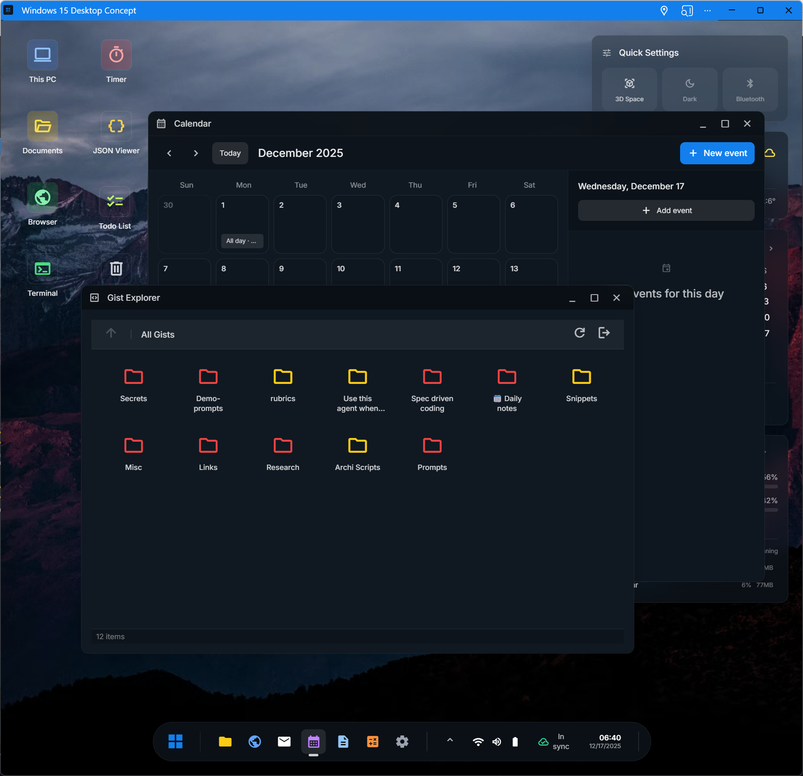

<div align="center">
  
  
  # Windows 15 Concept
  
  [](https://github.com/ThomasRohde/windows15/actions/workflows/ci.yml)
  [](https://react.dev)
  [](https://www.typescriptlang.org/)
  [](https://vitejs.dev)
  [](https://thomasrohde.github.io/windows15/docs/)

**A futuristic, web-based desktop environment built with modern web technologies.**

[Live Demo](https://thomasrohde.github.io/windows15/)

</div>

<br />

## 🚀 Experience the Future Web Desktop

Windows 15 is a fully functional desktop environment running entirely in your browser. It reimagines the operating system interface with glassmorphism, fluid animations, and a suite of powerful applications—all while maintaining local-first persistence.

## ✨ Key Features

- **🖥️ Full Desktop Environment:** Taskbar, Start Menu, System Tray, and a robust Window Manager with minimize/maximize/restore functionality.
- **☁️ Cloud Sync & Offline First:** Built on **Dexie.js**, your data persists locally in IndexedDB. Connect your own **Dexie Cloud** database to sync seamlessly across devices.
- **🎨 Stunning UI:** Custom-built glassmorphism design system using Tailwind CSS, featuring dark mode support and dynamic wallpapers.
- **� Notification Center:** Schedule and manage notifications with browser notification support and sound alerts.
- **📋 Clipboard History:** Access your clipboard history with **Ctrl+Shift+V** (up to 25 items).
- **🌐 Internationalization:** Full i18n support with 8 languages via LocalizationContext.
- **🖱️ Rich Interactions:** Context menus, desktop icons, drag-and-drop support, and global search.
- **⌨️ Developer Friendly:** Includes a suite of developer tools like Terminal, IDB Explorer, and Gist Explorer.

## 🔧 OS Services

Windows 15 provides a rich set of OS-level services through React contexts:

| Service            | Hook                 | Description                                           |
| ------------------ | -------------------- | ----------------------------------------------------- |
| **Window Manager** | `useWindowManager()` | Window lifecycle, geometry, z-order management        |
| **System Info**    | `useSystemInfo()`    | OS version, CPU cores, memory usage, storage metrics  |
| **Network Status** | `useNetwork()`       | Online status, connection type, latency measurement   |
| **Clipboard**      | `useClipboard()`     | Copy/paste with persistent history                    |
| **Notifications**  | `useNotifications()` | Scheduled and immediate notifications with sound      |
| **Localization**   | `useLocalization()`  | Date/time formatting, number formatting, translations |
| **Sound**          | `soundService`       | System sounds with volume control                     |
| **Screensaver**    | `useScreensaver()`   | Animated screensavers with customizable settings      |
| **Wallpaper**      | `useWallpaper()`     | Dynamic wallpaper management including shaders        |

See the [API documentation](https://thomasrohde.github.io/windows15/docs/) for detailed usage.

## 📦 App Ecosystem

Windows 15 comes pre-loaded with a variety of applications:

### 🛠️ Developer Tools

- **Terminal:** Command-line interface simulation.
- **IDB Explorer:** Inspect and manage your local IndexedDB database.
- **Gist Explorer:** Browse, view, and manage your GitHub Gists.
- **JSON Viewer:** Visualize and format JSON data.
- **Hash / Base64 / QR Tools:** Essential utilities for quick conversions.

### 💼 Productivity

- **Mail, Calendar & To-Do:** Stay organized.
- **Notepad:** A simple text editor for your thoughts.
- **Calculator & Unit Converter:** For all your calculation needs.

### 🎮 Media & Fun

- **Browser:** A browser-within-a-browser experience.
- **Wallpaper Studio:** Customize your desktop background.
- **YouTube Player:** Watch videos in a dedicated window.
- **Arcade:** Play casual games.

## 💻 Tech Stack

- **Framework:** React 19 + TypeScript
- **Build Tool:** Vite
- **Styling:** Tailwind CSS + CSS Modules
- **State/Persistence:** Dexie.js (IndexedDB) + Dexie Cloud
- **Testing:** Vitest + Playwright

## 🏃‍♂️ Getting Started

1.  **Clone the repository**

    ```bash
    git clone https://github.com/ThomasRohde/windows15.git
    cd windows15
    ```

2.  **Install dependencies**

    ```bash
    npm install
    ```

3.  **Start the development server**

    ```bash
    npm run dev
    ```

4.  **Build for production**
    ```bash
    npm run build
    ```

### Using OS Services

All OS services are available through React hooks. Wrap your app with `OSProvider` (already done in App.tsx) and use the hooks:

```tsx
import { useSystemInfo, useNetwork, useClipboard } from './context';

function MyApp() {
    const { memoryPercent, cpuCores } = useSystemInfo();
    const { isOnline, effectiveType } = useNetwork();
    const { copy, paste } = useClipboard();

    // Use the services...
}
```

For localization, use the `useLocalization` hook or the `useTranslation` hook from react-i18next:

```tsx
import { useLocalization } from './context';

function MyApp() {
    const { formatDate, formatNumber } = useLocalization();
    return <span>{formatDate(new Date())}</span>;
}
```

For system sounds, use the singleton `soundService`:

```tsx
import { soundService } from './utils';

soundService.play('notification');
```

## 🤝 Contributing

Contributions are welcome! Whether it's a new app, a UI polish, or a bug fix, feel free to open a Pull Request.

---

<div align="center">
  <sub>Built with ❤️ by Thomas Rohde</sub>
</div>
