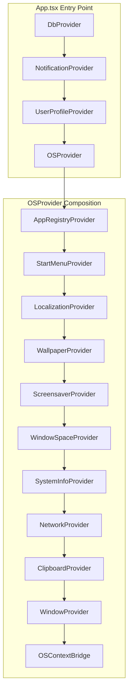
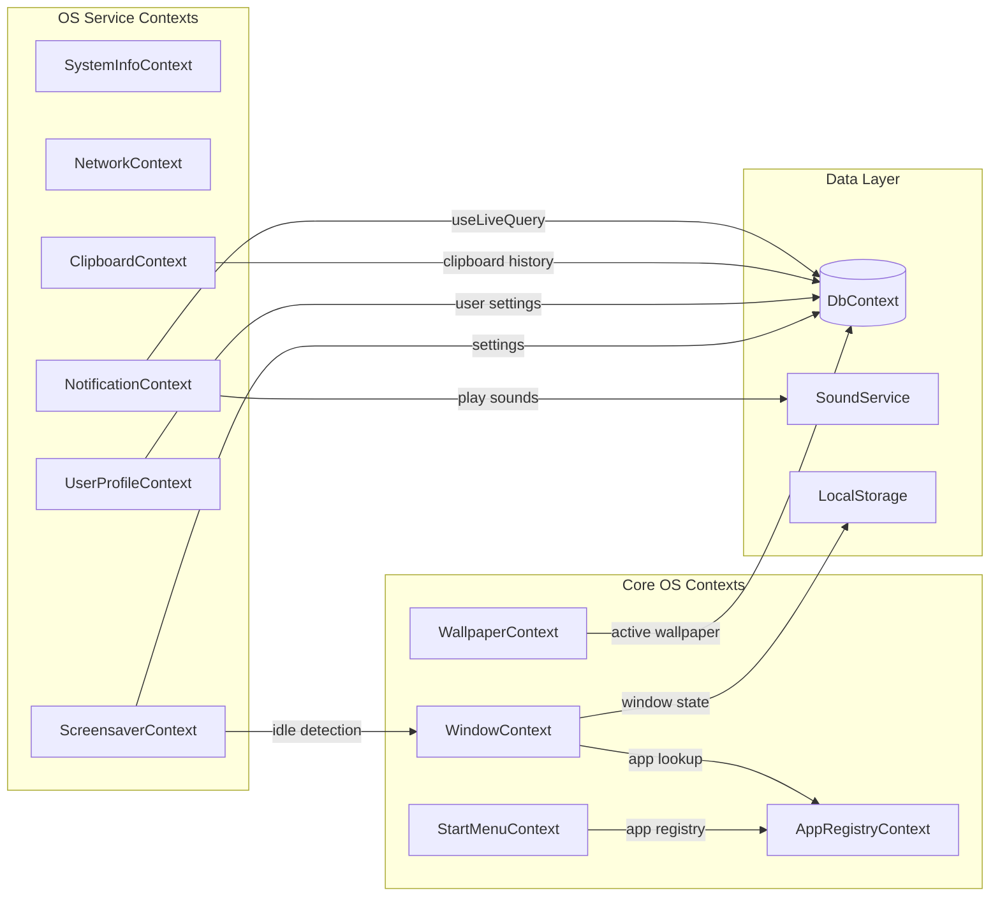
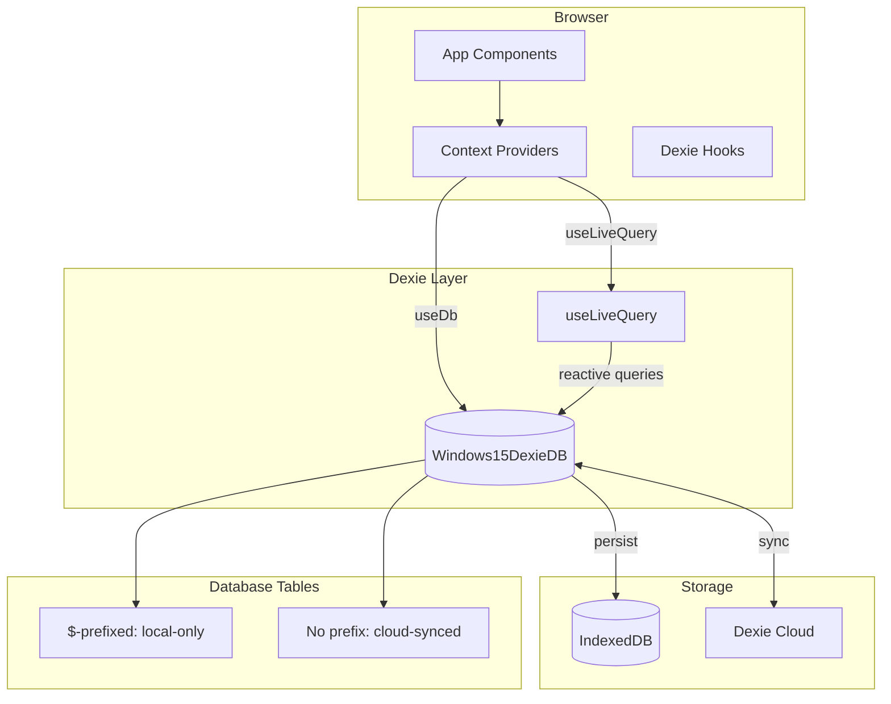
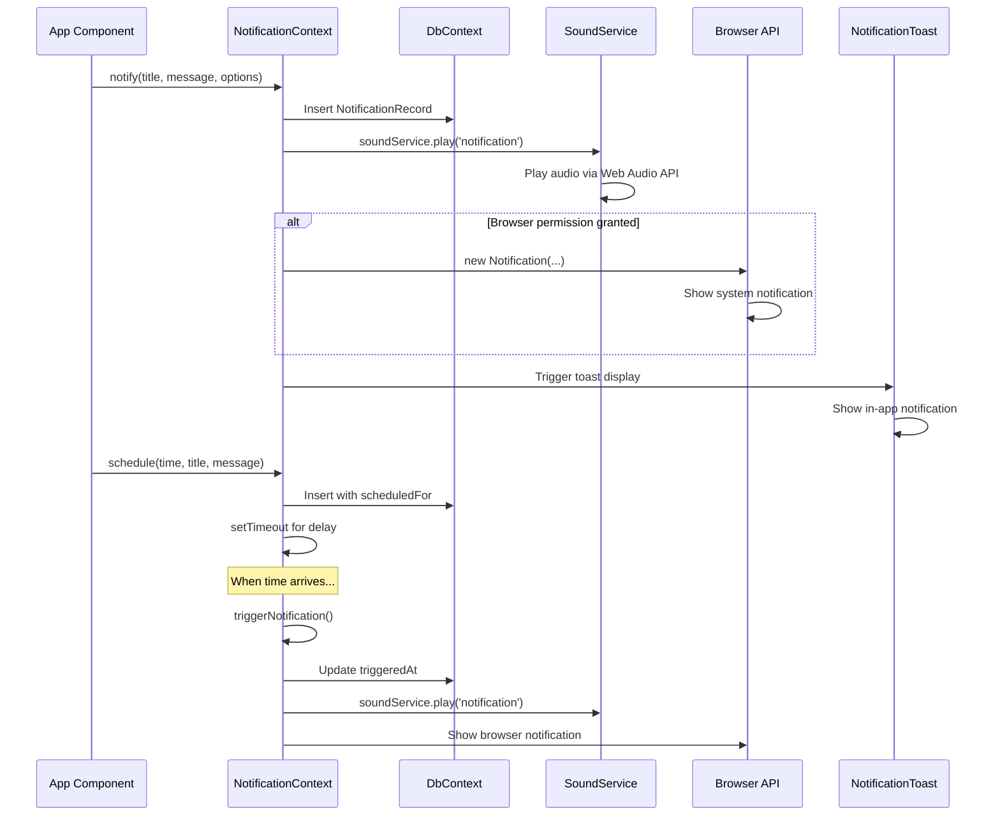
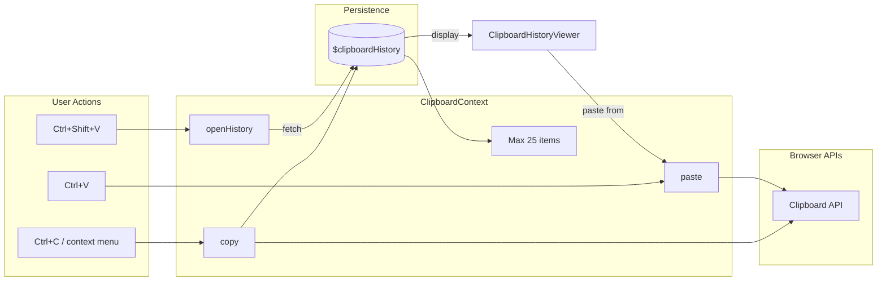
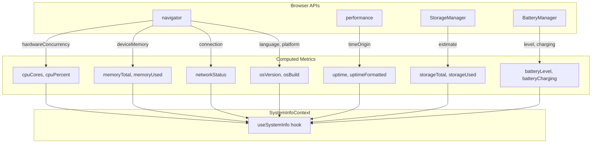
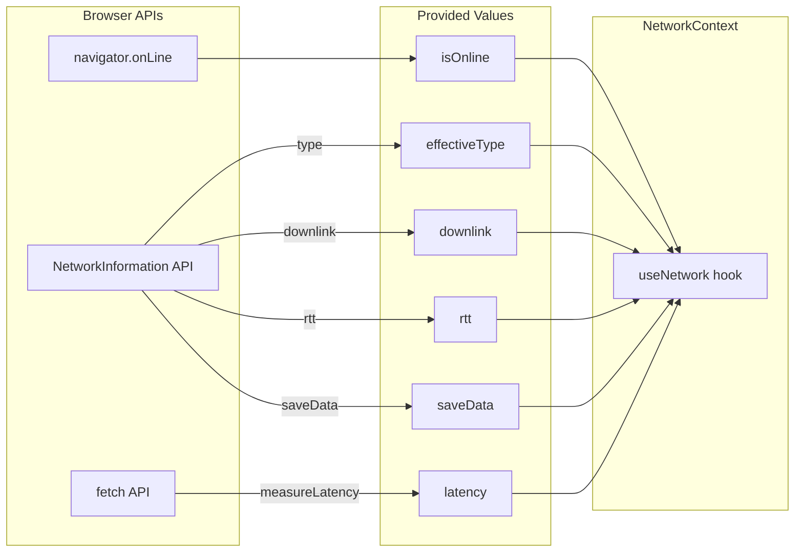

# Data Flow Architecture

## Overview

Windows 15 uses a layered architecture with React contexts managing OS-level state,
Dexie/IndexedDB for persistence, and service singletons for cross-cutting concerns.

## Provider Composition Hierarchy

The `OSProvider` composes all context providers in a specific order. Inner providers can access outer providers via hooks:



## Context Dependency Graph

Shows which contexts depend on which other contexts and services:



## DbContext Data Flow

The database layer uses Dexie with cloud sync for persistence:



### Database Table Categories

| Prefix | Sync Behavior | Examples                                                               |
| ------ | ------------- | ---------------------------------------------------------------------- |
| None   | Cloud-synced  | `notes`, `todos`, `bookmarks`, `emails`, `notifications`               |
| `$`    | Local-only    | `$terminalHistory`, `$clipboardHistory`, `$wallpapers`, `$arcadeGames` |

## Notification Pipeline

Complete flow from notification trigger to user feedback:



## Sound Service Architecture

```mermaid
flowchart TB
    subgraph "Sound Sources"
        SS[SoundSettings in localStorage]
        Assets[/sounds/ directory]
    end

    subgraph "SoundService Singleton"
        Init[initialize]
        Play[play]
        Vol[setVolume]
        Mute[toggleMute]
        Cache[Audio cache]
    end

    subgraph "Web Audio API"
        AC[AudioContext]
        GN[GainNode]
        BS[BufferSource]
    end

    subgraph "Consumers"
        NC2[NotificationContext]
        Apps[App Components]
        OS[OS Events]
    end

    SS --> Init
    Assets --> Init
    Init --> Cache
    Init --> AC

    NC2 --> Play
    Apps --> Play
    OS --> Play

    Play --> Cache
    Cache --> BS
    BS --> GN
    GN --> AC

    Vol --> GN
    Mute --> GN
```

### Available System Sounds

| Sound ID       | Usage                    |
| -------------- | ------------------------ |
| `notification` | New notification arrival |
| `startup`      | OS startup               |
| `shutdown`     | OS shutdown              |
| `error`        | Error dialogs            |
| `click`        | UI interactions          |

## Clipboard Context Data Flow



## SystemInfo Context Data Sources



## Network Context Data Sources



## Next

- State management overview: `core/state-management.md`
- Window lifecycle: `core/window-lifecycle.md`
- App architecture: `core/app-architecture.md`
